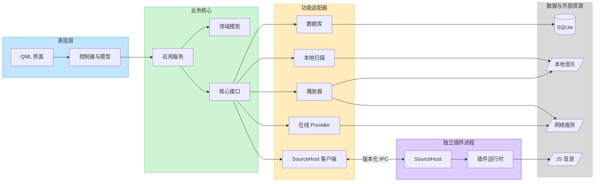

# 05 — Backend Bootstrap 架构

> 状态：**已批准**
> 范围：M0–M5 后端基础阶段

## 1. 架构原则

本阶段只固定长期需要稳定的接口和依赖方向，不提前固定内部文件、函数参数或第三方库。

- QML 只依赖控制器和列表模型；
- 应用层只依赖领域模型和抽象接口；
- SQLite、扫描、播放器、在线平台和插件宿主都是可替换适配器；
- JS 插件始终在独立 SourceHost 进程运行；
- 耗时任务不占用 GUI 线程；
- 平台 JSON、SQL、解码器和插件对象不得暴露给 QML；
- 未经实测的播放器能力保持关闭；
- Mock 和真实实现共用同一组接口。

以下内容暂不锁定：元数据库、JS 运行时、网易云协议实现、IPC 底层传输，以及 Qt Multimedia 后续是否替换为 FFmpeg + cubeb。

## 2. 总体架构图



依赖方向固定为：

```text
QML → QML Bridge → Application → Domain Interfaces ← Adapters
                                               ↑
                         SourceHost Client ↔ SourceHost Process
```

领域层不知道 Qt、SQL、平台 JSON 和播放器；适配器可以依赖领域接口，领域接口不能反向依赖适配器。

## 3. 功能区

| 功能区 | 主要职责 | 不能越过的边界 |
|---|---|---|
| `app` | 程序启动、对象装配、Mock/真实模式和有序退出 | 不写业务规则 |
| `domain` | 稳定 ID、歌曲、歌单、队列、播放状态和错误 | 不依赖 Qt 或基础设施 |
| `application` | 音乐库、播放、歌单、在线和设置的业务编排 | 不直接执行 SQL 或平台协议 |
| `infrastructure/database` | SQLite 连接、迁移、事务和 Repository 实现 | 不接触 QML |
| `infrastructure/library` | 文件筛选、增量扫描和元数据读取 | 不修改用户音乐 |
| `media` | 播放状态机、播放后端、设备和能力报告 | 不包含页面逻辑 |
| `online` | 在线平台适配、网络请求和内部模型转换 | 不向上泄漏原始 JSON |
| `sourcehost` | IPC、进程监督、插件生命周期和运行时适配 | 不访问主数据库或播放器 |
| `qmlbridge` | 控制器、列表模型、Mock 入口和结构化错误 | 不执行耗时任务 |
| `tests` | 单元、集成、契约、进程和启动测试 | 不使用真实账号和音乐库 |

目录只固定到功能区，内部文件可在实现时调整：

```text
src/
├── app/
├── domain/
├── application/ports/
├── infrastructure/database/
├── infrastructure/library/
├── media/
├── online/
├── sourcehost/{protocol,client,host}/
└── qmlbridge/

ui/bootstrap/
tests/{domain,database,library,media,online,sourcehost,qmlbridge,smoke}/
```

## 4. 核心接口架构

| 接口族 | 主要接口 | 稳定职责 |
|---|---|---|
| 数据仓储 | `ITrackRepository`、`IPlaylistRepository`、`ISettingsRepository`、`IPlayHistoryRepository` | 领域数据的查询、保存和事务边界 |
| 本地音乐 | `ILocalLibraryScanner`、`IMetadataReader` | 异步扫描、取消、增量变化和元数据标准化 |
| 播放器 | `IAudioPlayer`、`IPlaybackBackend`、`IAudioDeviceService`、`IEqualizerService` | 播放控制、后端替换、设备和能力查询 |
| 在线服务 | `IOnlineProvider` | 登录、搜索、推荐、歌单、排行榜和播放地址 |
| 插件宿主 | `ISourceHostClient`、`IPluginRuntime` | 进程生命周期、插件调用、超时、取消和运行时替换 |

### 4.1 Repository

Repository 只接收和返回领域对象，不暴露 SQL、表名、`QSqlQuery` 或数据库连接。应用层负责把仓储调用调度到数据库工作线程。

SQLite 是首个实现，但应用层不依赖 SQLite 类。首次 schema 覆盖歌曲、歌手、专辑、歌单、本地文件映射、历史、设置、Provider 缓存和迁移记录。

### 4.2 本地音乐

`ILocalLibraryScanner` 负责目录遍历、候选文件筛选、增量判断、进度和取消；`IMetadataReader` 只负责读取单个文件并返回标准化元数据。

扫描接口以 `ScanId` 标识一次运行：`start` 只交付有界 `Track` 批次，并且最终恰好回调一次 `Completed`、`Cancelled` 或 `Failed`；`cancel(ScanId)` 幂等，错误或过期 ID 不影响当前扫描。具体批大小、背压队列和内部 generation 属于扫描 module 的实现细节，不扩散到控制器和 QML。

扫描范围只能来自用户配置目录，默认不跟随目录符号链接，不复制、不移动、不改写音乐文件。

### 4.3 播放器

`IAudioPlayer` 是应用层入口，`IPlaybackBackend` 是具体技术后端。第一阶段使用 Qt Multimedia；以后更换后端不影响 QML、队列和播放服务。

统一状态：

```text
Idle / Loading / Playing / Paused / Stopped / Buffering / Error
```

能力标志分为：

- 基础能力：本地文件、HTTP/HTTPS、Seek、音量、静音、设备切换；
- 待验证能力：Gapless、Crossfade、ReplayGain、Equalizer、高解析音频。

待验证能力默认关闭，测试通过后才能开启。

### 4.4 在线 Provider

`IOnlineProvider` 统一覆盖：

- 登录状态、登录和退出；
- 搜索、每日推荐；
- 我的歌单、歌单详情和排行榜；
- 获取可播放歌曲或 URL；
- 取消、超时和 Provider 错误。

Provider 必须把平台响应转换成内部 `Track`、`Playlist`、`Chart` 和 `Account`。首阶段提供 `MockOnlineProvider`；`NeteaseProvider` 只建立协议边界，不猜测加密实现。

### 4.5 SourceHost

`ISourceHostClient` 位于主进程，负责宿主启动/停止、插件生命周期、请求、取消、超时和崩溃恢复。`IPluginRuntime` 位于 SourceHost 内部，用于替换 QuickJS、Node 或其他运行时。

版本化 IPC 至少表达：

- 握手、加载、卸载、初始化；
- 歌曲 URL、搜索、歌单和排行榜请求；
- 结果、错误、日志、超时、取消和退出。

协议只固定消息语义，不固定底层传输。插件不能获得主数据库、播放器或 QML 对象；SourceHost 崩溃不能带崩主程序；主程序退出时必须收尾。

## 5. 应用层和 QML 接口

### 应用服务

| 服务 | 使用的核心接口 | 向上提供 |
|---|---|---|
| 音乐库服务 | Repository、Scanner、Metadata Reader | 扫描、刷新、查询和进度 |
| 播放服务 | Audio Player、Device Service、Track Repository | 播放控制、队列和状态 |
| 歌单服务 | Playlist/Track Repository | 歌单和条目操作 |
| 在线服务 | Online Provider、SourceHost Client | 登录、搜索、推荐和播放地址 |
| 设置服务 | Settings Repository | 类型安全设置和变化通知 |

### QML Bridge

控制器：

- `AppController`
- `LibraryController`
- `PlayerController`
- `PlaylistController`
- `OnlineController`
- `SettingsController`

列表模型：

- `TrackListModel`
- `PlaylistListModel`
- `QueueModel`

控制器用 `Q_PROPERTY`、signals 和 `Q_INVOKABLE` 暴露轻量状态。耗时调用立即返回，结果、进度和错误异步通知。模型只做领域对象到 QML roles 的投影，不包含 SQL、网络和播放逻辑。

QML 错误统一为：类别、稳定错误码、可本地化消息键、可选技术详情和是否可重试。中文显示文案由 i18n 提供，不写入业务错误。

## 6. 进程和线程边界

| 执行位置 | 工作内容 |
|---|---|
| GUI 线程 | QML、控制器、列表模型和轻量状态 |
| 数据库工作线程 | 连接、迁移、事务和仓储调用 |
| 扫描线程池 | 目录遍历、增量判断和元数据读取 |
| 网络对象所属线程 | Provider 请求、超时和取消 |
| Qt Multimedia | 播放状态和音频输出 |
| SourceHost 进程 | JS 插件和插件运行时 |

目录遍历、SQL、大 JSON 解析、插件执行和音频处理不得阻塞 GUI。异步结果通过值对象和 queued signals 返回。

## 7. 数据流和 Mock

| 场景 | 调用链 |
|---|---|
| 本地扫描 | `LibraryController → 音乐库服务 → Scanner/Metadata Reader → Track Repository → TrackListModel` |
| 播放 | `PlayerController → 播放服务 → IAudioPlayer → IPlaybackBackend` |
| 在线平台 | `OnlineController → 在线服务 → IOnlineProvider → 内部模型 → QML Model` |
| JS 音源 | `在线/播放服务 → ISourceHostClient → IPC → SourceHost → IPluginRuntime` |

Mock 模式为前端和测试提供固定歌曲、歌单、队列、播放器状态、在线数据和插件响应，并能注入延迟、超时和错误。Mock 与真实实现使用相同接口，QML 不需要两套逻辑。

## 8. 可替换点

| 当前首选 | 接口边界 | 后续候选 |
|---|---|---|
| SQLite | Repository | 仍以 SQLite 为主，可调整 schema/DAO |
| 简单元数据替身 | `IMetadataReader` | 成熟原生元数据库 |
| Qt Multimedia | `IPlaybackBackend` | FFmpeg + cubeb |
| Mock Online Provider | `IOnlineProvider` | NeteaseProvider 等 |
| Mock Plugin Runtime | `IPluginRuntime` | QuickJS、必要的 Node 回退 |
| Qt 本地 IPC 候选 | 版本化 SourceHost 协议 | 其他本地传输 |

替换适配器不得迫使 QML 或领域模型同步重写。

## 9. 实施阶段

| 阶段 | 功能范围 |
|---|---|
| M0 | CMake、应用入口、测试框架和 Bootstrap QML |
| M1 | 领域模型、Repository、SQLite 和扫描接口 |
| M2 | 播放器接口、状态机、Qt Multimedia 和设备 |
| M3 | SourceHost、版本化 IPC、Mock runtime 和进程监督 |
| M4 | Online Provider、设置、控制器、模型和 Mock 模式 |
| M5 | Debug/Release、全量测试、性能实测和文档 |

每个阶段保持可独立构建和测试。具体文件数量、类拆分、函数参数和第三方依赖在实现阶段按最小可维护方案决定。

## 10. 审阅要点

本次只需确认：

1. 功能区划分；
2. QML → 应用层 → 领域接口 ← 适配器的依赖方向；
3. Repository、Scanner、Player、Provider、SourceHost 五组接口；
4. SourceHost 独立进程；
5. Mock 与真实实现共用接口；
6. 未验证能力默认关闭。

用户已确认功能区、依赖方向和接口边界，可以从 M0 开始；功能区内部可以在不破坏接口边界的前提下灵活调整。

## 批准记录

- 审阅人：用户
- 结论：批准实施
- 日期：2026-08-30
- 批准提交：backend/bootstrap 实施提交
