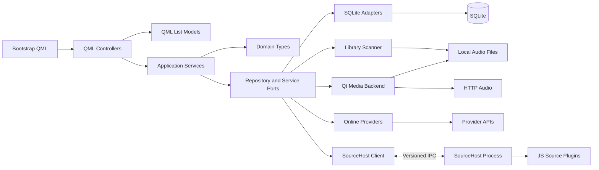

# 05 — Backend Bootstrap Architecture

> Status: **Candidate for review**
> Scope: M0–M5 backend bootstrap only
> Approval effect: once this document and the master plan are marked approved, implementation may start on `backend/bootstrap`

## 1. Purpose and review surface

This proposal turns the confirmed product decisions into an implementation boundary that the QML task can consume without waiting for final UI exports. It does not approve a particular Netease encryption implementation, a production JavaScript runtime, or B-level DSP capabilities that have not been measured.

The component diagram is maintained as Mermaid in this Markdown document so it is versioned, reviewable, and available without an external design tool.

The reviewer is asked to approve these six structural choices:

1. One Qt desktop process contains QML, application orchestration, domain code, SQLite adapters, online adapters, and the first Qt Multimedia backend.
2. Untrusted JS source plugins run only in a separately supervised `listenfree-sourcehost.exe` process.
3. QML depends only on controllers and `QAbstractListModel` implementations in `qmlbridge`.
4. Domain types and repository/service ports are plain C++20 and have no QML, SQL, platform JSON, or decoder dependencies.
5. SQLite access, scanning, network calls, metadata reading, and process IPC are adapters behind stable interfaces.
6. The bootstrap exposes truthful capability flags; Gapless, Crossfade, ReplayGain, Equalizer, and high-resolution support remain false until verified.

## 2. Component dependency view



Dependency direction is enforced by CMake targets, not only by folder names. `domain` never links to Qt. `application` may link to Qt Core for scheduling only if a Qt-free abstraction would add no test value; it never links to QML, SQL, Multimedia, or Network. Concrete adapters link inward to ports, while the executable composition root wires them together.

## 3. Runtime and thread boundaries

| Boundary | Owns | Must not do |
|---|---|---|
| GUI thread | QML engine, controllers, list models, small immutable view snapshots | Traverse directories, wait on IPC, execute SQL, parse provider payloads, decode audio |
| Database worker | Per-thread SQLite connection, migrations, repository commands | Touch QML objects or share a `QSqlDatabase` connection across threads |
| Scan pool | Directory traversal and metadata-reader calls, cancellation checks | Scan outside explicitly configured roots or modify media files |
| Qt Multimedia | `QMediaPlayer`, `QAudioOutput`, device notifications | Claim unsupported DSP or gapless behavior |
| Qt Network owner | Online-provider requests, timeout and cancellation | Return provider JSON to QML |
| SourceHost process | Plugin lifecycle, runtime adapter, compatibility shim | Open the main database or obtain player/controller pointers |

All asynchronous completions return value objects and are marshalled to the GUI thread through queued signals. No QObject with GUI affinity is captured by a worker task without a guarded queued handoff.

## 4. Planned CMake targets

| Target | Type | Direct dependencies | Responsibility |
|---|---|---|---|
| `listenfree_domain` | STATIC | C++20 standard library | IDs, entities, errors, queue and value types |
| `listenfree_application` | STATIC | `listenfree_domain`, Qt Core | Use cases, orchestration, settings and cancellation |
| `listenfree_database` | STATIC | domain/application ports, Qt Core, Qt SQL | Connections, transactions, migrations, SQLite repositories |
| `listenfree_library` | STATIC | domain/application ports, Qt Core | Cancelable incremental scan and metadata-reader boundary |
| `listenfree_media` | STATIC | domain/application ports, Qt Core, Qt Multimedia | State machine, Qt backend, devices and capabilities |
| `listenfree_source_protocol` | STATIC | domain error primitives, Qt Core | Versioned messages, frame codec and validation |
| `listenfree_source_client` | STATIC | protocol, Qt Core, Qt Network | Process supervision, local IPC, timeout and cancellation |
| `listenfree-sourcehost` | EXECUTABLE | protocol, Qt Core, Qt Network | Isolated host and replaceable runtime adapter |
| `listenfree_online` | STATIC | domain/application ports, Qt Core, Qt Network | Mock provider and Netease boundary |
| `listenfree_qmlbridge` | STATIC | application, Qt Core, Qt Qml | Controllers, list models and structured view errors |
| `listenfree` | WIN32 EXECUTABLE | all production libraries, Qt Quick | Composition root and bootstrap QML resource |
| `listenfree_tests` | TEST EXECUTABLES | tested target, Qt Test | Unit/integration/contract/smoke tests |

Forbidden links are checked during review: `domain -> Qt`, `qmlbridge -> QtSql`, `qmlbridge -> QtMultimedia`, `qmlbridge -> provider implementation`, `sourcehost -> database`, and `sourcehost -> media`.

## 5. Planned repository layout

The following are planned implementation files. They do not exist until approval unless identified as design/tooling files.

```text
ListenFree-desktop/
├── CMakeLists.txt
├── CMakePresets.json
├── cmake/
│   ├── ListenFreeOptions.cmake
│   ├── ListenFreeWarnings.cmake
│   └── ListenFreeSanitizers.cmake
├── scripts/
│   ├── enter-dev-shell.ps1
│   ├── verify-toolchain.ps1
│   ├── build.ps1
│   └── measure-bootstrap.ps1
├── src/
│   ├── app/
│   │   ├── main.cpp
│   │   ├── ApplicationContext.h
│   │   └── ApplicationContext.cpp
│   ├── domain/
│   │   ├── CMakeLists.txt
│   │   ├── Result.h
│   │   ├── StrongId.h
│   │   ├── ProviderId.h
│   │   ├── TrackId.h
│   │   ├── PlaylistId.h
│   │   ├── Track.h
│   │   ├── Album.h
│   │   ├── Artist.h
│   │   ├── Playlist.h
│   │   ├── PlaylistEntry.h
│   │   ├── PlaybackItem.h
│   │   ├── PlaybackQueue.h
│   │   ├── PlaybackState.h
│   │   ├── PlaybackError.h
│   │   ├── AudioFormatInfo.h
│   │   ├── LyricLine.h
│   │   ├── Account.h
│   │   └── Chart.h
│   ├── application/
│   │   ├── CMakeLists.txt
│   │   ├── Cancellation.h
│   │   ├── TaskResult.h
│   │   ├── LibraryService.h/.cpp
│   │   ├── PlaybackService.h/.cpp
│   │   ├── PlaylistService.h/.cpp
│   │   ├── OnlineService.h/.cpp
│   │   ├── SettingsService.h/.cpp
│   │   └── ports/
│   │       ├── ITrackRepository.h
│   │       ├── IPlaylistRepository.h
│   │       ├── ISettingsRepository.h
│   │       ├── ILocalLibraryScanner.h
│   │       ├── IAudioPlayer.h
│   │       ├── IPlaybackBackend.h
│   │       ├── IAudioDeviceService.h
│   │       ├── IEqualizerService.h
│   │       ├── ISourceHostClient.h
│   │       └── IOnlineProvider.h
│   ├── infrastructure/
│   │   ├── database/
│   │   │   ├── CMakeLists.txt
│   │   │   ├── DatabaseConnectionFactory.h/.cpp
│   │   │   ├── DatabaseTransaction.h/.cpp
│   │   │   ├── DatabaseMigrator.h/.cpp
│   │   │   ├── SqliteTrackRepository.h/.cpp
│   │   │   ├── SqlitePlaylistRepository.h/.cpp
│   │   │   ├── SqliteSettingsRepository.h/.cpp
│   │   │   └── migrations/
│   │   │       ├── migrations.qrc
│   │   │       └── 0001_initial.sql
│   │   ├── library/
│   │   │   ├── CMakeLists.txt
│   │   │   ├── AudioFileFilter.h/.cpp
│   │   │   ├── IMetadataReader.h
│   │   │   ├── StubMetadataReader.h/.cpp
│   │   │   └── LocalLibraryScanner.h/.cpp
│   │   └── settings/
│   │       ├── SettingKey.h
│   │       └── SettingValueCodec.h/.cpp
│   ├── media/
│   │   ├── CMakeLists.txt
│   │   ├── PlayerCapabilities.h
│   │   ├── PlaybackStateMachine.h/.cpp
│   │   ├── QtMediaPlayerBackend.h/.cpp
│   │   ├── QtAudioDeviceService.h/.cpp
│   │   └── UnsupportedEqualizerService.h/.cpp
│   ├── sourcehost/
│   │   ├── protocol/
│   │   │   ├── CMakeLists.txt
│   │   │   ├── ProtocolVersion.h
│   │   │   ├── SourceMessage.h
│   │   │   ├── SourceError.h
│   │   │   ├── MessageCodec.h/.cpp
│   │   │   └── FrameCodec.h/.cpp
│   │   ├── client/
│   │   │   ├── CMakeLists.txt
│   │   │   ├── SourceHostClient.h/.cpp
│   │   │   └── SourceHostSupervisor.h/.cpp
│   │   └── host/
│   │       ├── CMakeLists.txt
│   │       ├── main.cpp
│   │       ├── SourceHostServer.h/.cpp
│   │       ├── IPluginRuntime.h
│   │       ├── MockPluginRuntime.h/.cpp
│   │       └── LxCompatibilityContract.h
│   ├── online/
│   │   ├── CMakeLists.txt
│   │   ├── MockOnlineProvider.h/.cpp
│   │   └── netease/
│   │       ├── NeteaseProvider.h/.cpp
│   │       ├── NeteaseTransport.h
│   │       └── NeteaseResponseMapper.h/.cpp
│   └── qmlbridge/
│       ├── CMakeLists.txt
│       ├── AppController.h/.cpp
│       ├── LibraryController.h/.cpp
│       ├── PlayerController.h/.cpp
│       ├── PlaylistController.h/.cpp
│       ├── OnlineController.h/.cpp
│       ├── SettingsController.h/.cpp
│       ├── TrackListModel.h/.cpp
│       ├── PlaylistListModel.h/.cpp
│       ├── QueueModel.h/.cpp
│       ├── ViewError.h/.cpp
│       └── QmlBridgeRegistration.h/.cpp
├── ui/
│   └── bootstrap/
│       ├── Main.qml
│       └── qmldir
└── tests/
    ├── CMakeLists.txt
    ├── fixtures/
    │   ├── generate-test-wav.ps1
    │   └── plugins/mock-source.js
    ├── domain/
    ├── database/
    ├── library/
    ├── media/
    ├── sourcehost/
    ├── online/
    ├── qmlbridge/
    └── smoke/
```

`ui/imported/figma` and any Pixso-generated directory are deliberately absent from the bootstrap target graph.

## 6. File responsibilities and key functions

### 6.1 Composition and application services

| File | Public responsibility | Key functions |
|---|---|---|
| `src/app/main.cpp` | Create `QGuiApplication`, register bridge types, construct context, load bootstrap QML | `main()` |
| `ApplicationContext.h/.cpp` | Own services and adapters in destruction-safe order; select mock mode | `initialize()`, `shutdown()`, controller getters |
| `LibraryService.h/.cpp` | Start/cancel scans and publish immutable library snapshots | `scan(request)`, `cancelScan(id)`, `tracks(query)` |
| `PlaybackService.h/.cpp` | Own queue intent and map backend events to stable state | `open(item)`, `play()`, `pause()`, `stop()`, `seek(position)`, `setVolume(value)` |
| `PlaylistService.h/.cpp` | CRUD and ordered entry edits | `create()`, `rename()`, `append()`, `moveEntry()`, `removeEntry()` |
| `OnlineService.h/.cpp` | Select provider and normalize asynchronous provider results | `search()`, `dailyRecommendations()`, `playlists()`, `resolvePlayable()` |
| `SettingsService.h/.cpp` | Validate typed values and persist stable English keys | `get(key)`, `set(key, value)`, `snapshot()` |

Services return request handles or typed results. Controllers never retain database rows, provider JSON documents, or media backend objects.

### 6.2 Domain types

All domain headers use standard-library types. Strings that may be absent use `std::optional<std::string>`; empty text is not overloaded to mean missing. Durations use `std::chrono::milliseconds`. Large collections are passed as `std::span<const T>` or moved into owning results.

| Type | Required invariant or behavior |
|---|---|
| `StrongId<Tag>` | Non-empty stable UTF-8 value; equality and hashing do not use display names |
| `ProviderId`, `TrackId`, `PlaylistId` | Strong aliases preventing cross-ID assignment |
| `Track` | Stable ID, title, optional album, artist IDs, duration, source and playable locator |
| `Album`, `Artist` | Stable ID plus display metadata; no database foreign-key behavior |
| `Playlist`, `PlaylistEntry` | Playlist metadata separated from ordered entries |
| `PlaybackItem` | Track snapshot plus resolved local/HTTP locator and optional expiry |
| `PlaybackQueue` | Current cursor and ordered items; deterministic insert/remove/move/next/previous |
| `PlaybackState` | `Idle`, `Loading`, `Playing`, `Paused`, `Stopped`, `Buffering`, `Error` |
| `PlaybackError` | Category, stable code, technical detail, retryability and optional provider ID |
| `AudioFormatInfo` | Codec, sample rate, channels, sample format and bitrate when known |
| `LyricLine` | Start/end time, text, optional word timing; no QML animation state |
| `Account`, `Chart` | Provider-owned stable IDs mapped to internal fields |
| `Result<T, E>` | Explicit success/error variant for synchronous boundaries |

`PlaybackQueue` exposes `enqueue`, `insertNext`, `remove`, `move`, `select`, `next`, `previous`, `clear`, `current`, and `items`. Invalid cursor mutations return a typed queue error and leave state unchanged.

### 6.3 Repository ports

```cpp
class ITrackRepository {
public:
    virtual ~ITrackRepository() = default;
    virtual Result<void, RepositoryError> upsert(std::span<const Track> tracks) = 0;
    virtual Result<std::optional<Track>, RepositoryError> findById(const TrackId&) = 0;
    virtual Result<std::vector<Track>, RepositoryError> search(const TrackQuery&) = 0;
    virtual Result<void, RepositoryError> removeMissingLocalFiles(std::span<const std::string> paths) = 0;
};

class IPlaylistRepository {
public:
    virtual ~IPlaylistRepository() = default;
    virtual Result<std::vector<Playlist>, RepositoryError> list() = 0;
    virtual Result<Playlist, RepositoryError> save(const Playlist&) = 0;
    virtual Result<void, RepositoryError> replaceEntries(const PlaylistId&, std::span<const PlaylistEntry>) = 0;
    virtual Result<void, RepositoryError> remove(const PlaylistId&) = 0;
};
```

Repository calls are synchronous at the port because transaction boundaries must be explicit. Application services schedule them on the database worker and return asynchronously to QML.

### 6.4 Database implementation

`DatabaseConnectionFactory` creates one named `QSQLITE` connection per owning thread. Connection objects are never copied to another thread. `DatabaseTransaction` begins in its constructor and rolls back unless `commit()` succeeds. `DatabaseMigrator::migrateToLatest()` executes ordered embedded SQL resources and records checksums in `schema_migrations`.

Initial schema:

| Table | Key and purpose | Required indexes |
|---|---|---|
| `tracks` | `track_id`; normalized track metadata | title, album ID, provider/source |
| `artists` | `artist_id`; artist metadata | normalized name |
| `albums` | `album_id`; album metadata | normalized title, primary artist |
| `track_artists` | `(track_id, artist_id, ordinal)` | artist ID, track ID |
| `playlists` | `playlist_id`; local/provider playlist metadata | provider and modified time |
| `playlist_entries` | `entry_id`; ordered membership | unique playlist/position, track ID |
| `local_files` | canonical path mapped to track | unique canonical path, size/mtime tuple |
| `play_history` | append/update playback events | played time, track ID |
| `settings` | stable English key and typed serialized value | primary key only |
| `provider_cache` | provider/key response with expiry | unique provider/cache key, expiry |

Foreign keys are enabled for every connection. Migrations run in a transaction, are idempotent on repeated startup, and fail closed on checksum mismatch. Tests use `QTemporaryDir`; no test opens the user's application database.

### 6.5 Local scanner

```cpp
struct ScanRequest {
    std::vector<std::filesystem::path> roots;
    bool recursive{true};
    bool followDirectorySymlinks{false};
};

class ILocalLibraryScanner {
public:
    virtual ~ILocalLibraryScanner() = default;
    virtual ScanHandle start(ScanRequest, ScanObserver&) = 0;
    virtual void cancel(ScanHandle) = 0;
};
```

`AudioFileFilter` recognizes `mp3`, `flac`, `wav`, `aac`, `m4a`, `ogg`, `oga`, `opus`, `wma`, `ape`, `wv`, `aiff`, `aif`, `tta`, and audio-bearing `mp4` as candidates. Recognition only schedules metadata/decode validation; it is not a support claim.

Incremental identity starts with canonical path, file size, and nanosecond modification time. Unchanged files skip metadata reading. Removed rows are reconciled only inside the requested roots. Symbolic directory links are disabled by default to prevent loops and scope escape. `IMetadataReader` is a narrow replaceable interface; M1 uses a deterministic stub in tests rather than adding a large tag library prematurely.

### 6.6 Player ports and state machine

```cpp
enum class PlayerCapability : std::uint32_t {
    LocalFile = 1U << 0,
    HttpStream = 1U << 1,
    Seek = 1U << 2,
    Volume = 1U << 3,
    Mute = 1U << 4,
    DeviceChange = 1U << 5,
    Gapless = 1U << 6,
    Crossfade = 1U << 7,
    ReplayGain = 1U << 8,
    Equalizer = 1U << 9,
    HighResolution = 1U << 10
};

class IPlaybackBackend {
public:
    virtual ~IPlaybackBackend() = default;
    virtual PlayerCapabilities capabilities() const noexcept = 0;
    virtual void open(const PlaybackItem&) = 0;
    virtual void play() = 0;
    virtual void pause() = 0;
    virtual void stop() = 0;
    virtual void seek(std::chrono::milliseconds) = 0;
    virtual void setVolume(float normalized) = 0;
    virtual void setMuted(bool) = 0;
};
```

`IAudioPlayer` is the application-facing coordinator; `IPlaybackBackend` is the replaceable decoder/output boundary. The first `QtMediaPlayerBackend` adapts `QMediaPlayer` and `QAudioOutput`. The state machine validates events independently of Qt so tests can cover legal transitions and stale callbacks. Capability bits for the five B-level features default to false.

`IAudioDeviceService` enumerates stable device IDs and reports default/output changes. `IEqualizerService` exists from M2, but its bootstrap implementation returns a structured unsupported error and never reports an enabled capability.

### 6.7 SourceHost protocol and lifecycle

Transport is local-only `QLocalServer`/`QLocalSocket` with length-prefixed UTF-8 JSON frames. The frame length is validated before allocation. JSON is acceptable for low-frequency commands and results; plugin audio bytes and PCM never pass through it.

Every envelope contains:

```text
protocolVersion, messageType, requestId, deadlineMs, payload, error
```

Bootstrap message types:

| Direction | Messages |
|---|---|
| App to host | `hello`, `loadPlugin`, `unloadPlugin`, `initialize`, `resolveMusicUrl`, `search`, `getPlaylist`, `getChart`, `cancel`, `shutdown` |
| Host to app | `helloAck`, `result`, `error`, `log`, `progress`, `exited` |

The codec rejects unsupported versions, missing request IDs, unknown mandatory fields, oversized frames, invalid payload types, and responses for completed/cancelled requests. `SourceHostSupervisor` starts on demand, uses a per-session random local-server name passed through the child command line, enforces startup/request/shutdown deadlines, and applies bounded restart backoff after crashes.

`IPluginRuntime` isolates runtime choice:

```cpp
class IPluginRuntime {
public:
    virtual ~IPluginRuntime() = default;
    virtual RuntimeResult load(const PluginDescriptor&) = 0;
    virtual RuntimeResult initialize(const InitContext&) = 0;
    virtual RuntimeResult invoke(const PluginRequest&, std::stop_token) = 0;
    virtual void unload() noexcept = 0;
};
```

M3 implements `MockPluginRuntime` and contract tests only. QuickJS and a necessary Node fallback remain future adapters; no Chromium, CEF, Qt WebEngine, database handle, or player pointer is linked into SourceHost.

### 6.8 Online providers

```cpp
class IOnlineProvider {
public:
    virtual ~IOnlineProvider() = default;
    virtual ProviderId id() const = 0;
    virtual RequestHandle login(const LoginRequest&, ProviderObserver&) = 0;
    virtual RequestHandle logout(ProviderObserver&) = 0;
    virtual RequestHandle search(const SearchRequest&, ProviderObserver&) = 0;
    virtual RequestHandle dailyRecommendations(ProviderObserver&) = 0;
    virtual RequestHandle userPlaylists(ProviderObserver&) = 0;
    virtual RequestHandle playlistDetail(const PlaylistId&, ProviderObserver&) = 0;
    virtual RequestHandle charts(ProviderObserver&) = 0;
    virtual RequestHandle resolvePlayable(const TrackId&, ProviderObserver&) = 0;
    virtual void cancel(RequestHandle) = 0;
};
```

`MockOnlineProvider` returns deterministic tracks, playlists, account state and optional injected errors for QML/tests. `NeteaseProvider` is only a namespace, transport boundary and response-mapping shell in this bootstrap. Authentication/encryption is not hard-coded until tested against a documented reference implementation. Provider JSON remains inside `online/netease`.

### 6.9 QML facade

Controllers are QObject facades with stable English object names. Commands are `Q_INVOKABLE`; state uses `Q_PROPERTY` and notify signals. Each asynchronous command returns a request ID immediately. Structured errors expose `category`, `code`, `messageKey`, `technicalDetail`, and `retryable`; Chinese wording is supplied later by i18n, not by backend keys.

| File | Properties and commands |
|---|---|
| `AppController` | `ready`, `mockMode`, `lastError`; `initialize()`, `shutdown()` |
| `LibraryController` | `scanning`, `progress`, `tracks`; `scan(paths)`, `cancelScan()`, `refresh()` |
| `PlayerController` | `state`, `currentTrack`, `position`, `duration`, `buffered`, `volume`, `muted`, `capabilities`; playback commands |
| `PlaylistController` | `playlists`, `selectedPlaylist`; create/rename/delete/entry commands |
| `OnlineController` | `providerEnabled`, `account`, `loading`, result models; login/logout/search/recommendation commands |
| `SettingsController` | typed playback/library/lyrics/provider/sourcehost/log properties; setters validate through `SettingsService` |
| `TrackListModel` | ID, title, artist, album, duration, artwork, source and availability roles |
| `PlaylistListModel` | ID, title, owner, track count, artwork and provider roles |
| `QueueModel` | queue ID, track roles, current marker and availability roles; move/remove methods |

Models update with `beginInsertRows`, `beginRemoveRows`, `beginMoveRows`, or `dataChanged`; routine updates do not reset the entire model. Bootstrap QML demonstrates model access and controlled shutdown only. It contains no final styling or generated design files.

### 6.10 Settings keys

`SettingKey<T>` defines the stable key, default and validator. Initial keys are:

```text
playback.volume
playback.muted
playback.mode
audio.outputDeviceId
library.roots
library.scanOnStartup
library.followDirectorySymlinks
lyrics.enabled
lyrics.wordTimingEnabled
online.enabledProviders
sourceHost.enabled
logging.level
```

Serialization includes an explicit value type. Unknown keys are retained where possible during migrations but are never exposed as arbitrary writable QML properties.

## 7. CMake presets and warning policy

Planned presets:

| Preset | Generator/configuration | Purpose |
|---|---|---|
| `windows-debug` | Ninja, Debug, configured Qt root | Development build |
| `windows-release` | Ninja, Release, configured Qt root | Performance and deployment build |
| `windows-debug-tests` | Inherits debug, `BUILD_TESTING=ON` | Configure tests |
| `test-debug` | CTest preset, output on failure | Full Debug tests |
| `test-release` | CTest preset, output on failure | Full Release tests |

MSVC uses `/W4 /permissive- /Zc:__cplusplus /EHsc`; MinGW uses `-Wall -Wextra -Wpedantic -Wconversion -Wshadow`. Warnings from explicitly imported third-party targets are isolated, never disabled globally. Project warnings become errors in CI only after the initial bootstrap is warning-clean.

Current design-stage environment is configured by `scripts/enter-dev-shell.ps1`: Qt 6.9.0 MinGW x64, CMake 3.30.5, Ninja 1.12.1 and GCC 13.1. It is a reversible local verification kit. The production release kit remains subject to an explicit Qt 6.8 LTS + MSVC 2022 x64 validation before packaging.

## 8. Verification matrix

| Test file | Verifies |
|---|---|
| `tests/domain/DomainTypesTest.cpp` | Strong IDs, optional fields, equality and value invariants |
| `tests/domain/PlaybackQueueTest.cpp` | Cursor, insert/move/remove, boundaries and unchanged-on-error behavior |
| `tests/database/MigrationTest.cpp` | First creation, repeated migration, schema version and checksum failure |
| `tests/database/RepositoryTest.cpp` | Track/playlist CRUD, order, indexes and foreign keys |
| `tests/database/TransactionTest.cpp` | Commit and automatic rollback in a temporary database |
| `tests/library/LocalLibraryScannerTest.cpp` | Extensions, cancellation, symlink policy and incremental skip/update/remove |
| `tests/media/PlaybackStateMachineTest.cpp` | All legal transitions, stale events and structured errors |
| `tests/media/QtMediaBackendTest.cpp` | Generated WAV open/play/pause/seek/stop and truthful capabilities |
| `tests/sourcehost/ProtocolCodecTest.cpp` | Round trip, version mismatch, malformed and oversized frames |
| `tests/sourcehost/SourceHostProcessTest.cpp` | Start, handshake, request, timeout, cancel, crash recovery and exit |
| `tests/online/MockOnlineProviderTest.cpp` | Login state, deterministic data, cancellation and injected error |
| `tests/qmlbridge/ListModelsTest.cpp` | Roles, row counts and incremental Qt model signals |
| `tests/smoke/ApplicationSmokeTest.cpp` | Minimal QML load, mock tracks/playlists/queue/state and clean exit |

No network-dependent or real-account test is required for bootstrap acceptance. The playback fixture is a short WAV generated inside the test build tree.

## 9. Milestone-to-file delivery

| Milestone | Files/targets created | Gate |
|---|---|---|
| M0 | root CMake, presets, warning modules, app composition, bootstrap QML, test harness | Clean Debug configure/build and QML smoke exit |
| M1 | `domain`, `application/ports`, `database`, scanner boundary and tests | Temporary SQLite migrations/CRUD/rollback all pass |
| M2 | `media`, state machine, Qt backend and generated WAV tests | Local and HTTP boundary compile; tested capabilities only |
| M3 | protocol/client/host targets, mock runtime and process tests | Handshake, timeout, cancel, crash recovery and shutdown pass |
| M4 | provider interfaces/mock, controllers/models/settings and mock QML data | QML reads tracks, playlists, queue and state without internal adapters |
| M5 | build/measurement scripts, architecture/results/dependencies docs | Debug/Release, full CTest and measured baselines recorded |

Each milestone is committed independently. Failure in one adapter does not permit a fake implementation; unaffected targets continue and evidence is added to `docs/implementation/backend-blockers.md`.

## 10. Performance measurement plan

`scripts/measure-bootstrap.ps1` will launch the Release executable with a deterministic temporary profile and measure:

- wall-clock process creation to `AppController.ready` using a timestamped readiness marker;
- first database creation around `DatabaseMigrator::migrateToLatest()`;
- process-tree private working set and commit size after a 30-second idle stabilization;
- the same process-tree metrics while playing the generated WAV fixture;
- process count and per-process values, so SourceHost cost is visible.

Each scenario runs at least three times and reports all samples, median and maximum. GPU figures are reported only if a reproducible Windows counter is available. Missing counters are marked unavailable rather than estimated.

## 11. Explicit non-goals of the bootstrap

- Final Pixso/Figma QML integration or visual styling.
- Declaring complete JS source compatibility from a mock runtime.
- Guessing Netease authentication or encryption.
- Production metadata tagging library selection.
- Gapless, Crossfade, ReplayGain, Equalizer, high-resolution, WASAPI exclusive or bit-perfect claims.
- HLS, WebDAV, LAN shares, download manager, installer and application auto-update.

## 12. Approval record

- Reviewer: pending
- Decision: pending
- Date: pending
- Approved commit: pending
- Required follow-up on approval: change this document to **Approved**, update `docs/design/README.md` and `docs/design/99-master-plan.md`, then resume M0 on `backend/bootstrap`.
